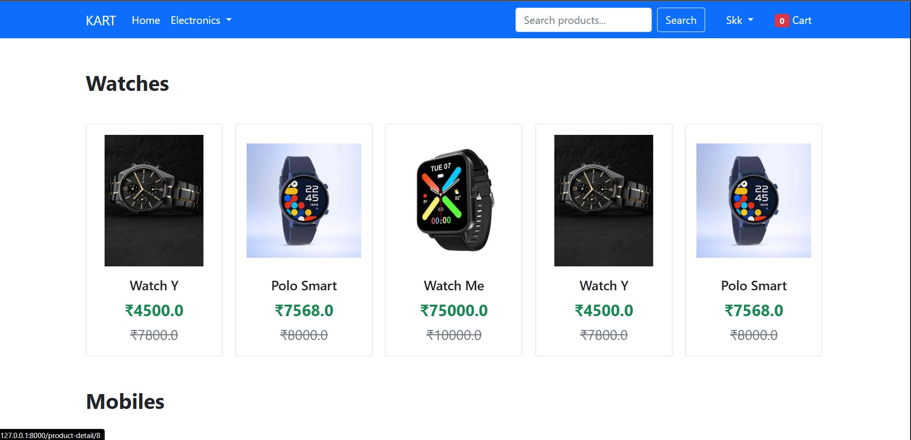
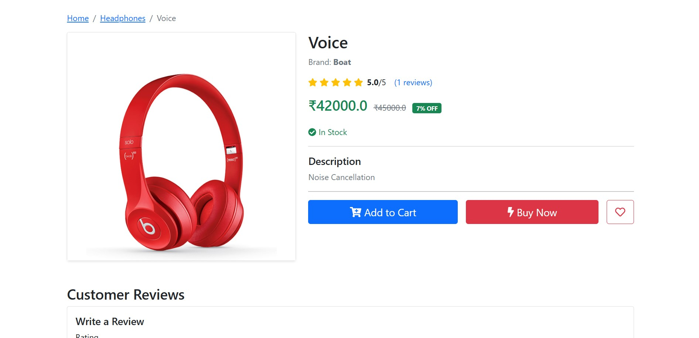
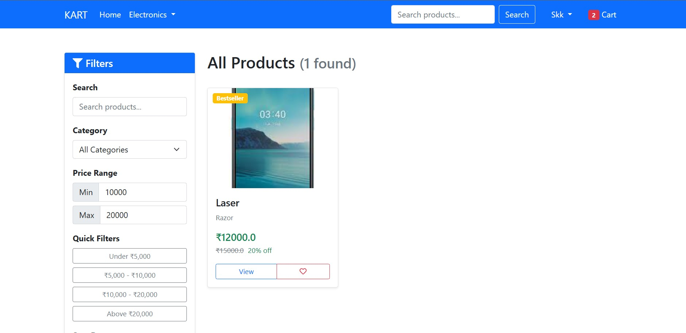
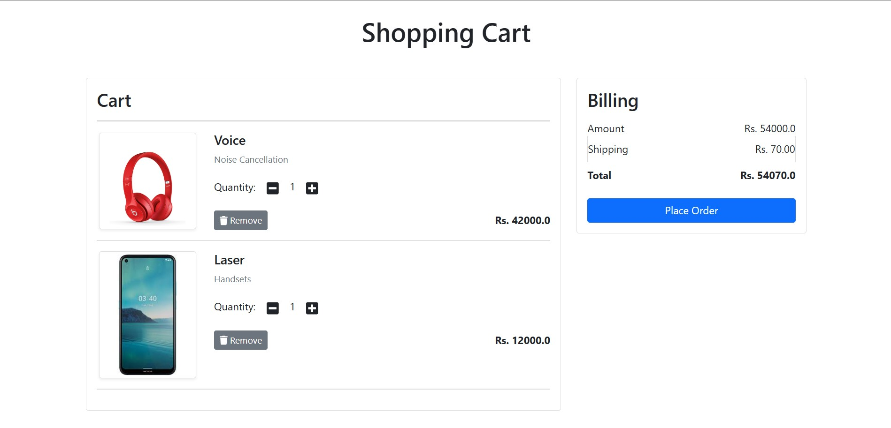
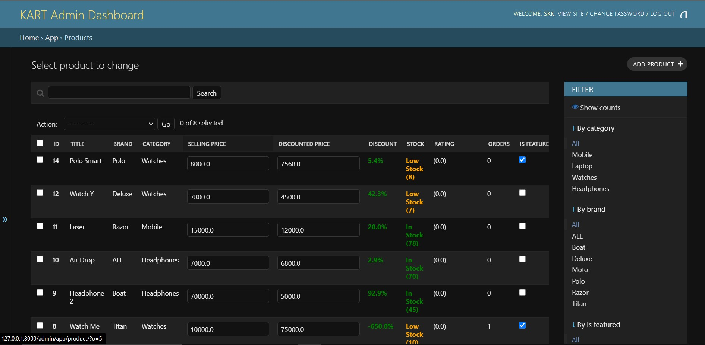

# KART - E-Commerce Platform

> A full-stack e-commerce platform built with Django, featuring 110+ advanced features, security, and enterprise-grade architecture.

<!-- [Live Demo](https://kart-demo.herokuapp.com) -->

---

## Screenshots

<table>
  <tr>
    <td><br/><sub><b>Homepage</b></sub></td>
    <td><br/><sub><b>Product Detail</b></sub></td>
    <td><br/><sub><b>Search & Filter</b></sub></td>
  </tr>
  <tr>
    <td><br/><sub><b>Shopping Cart</b></sub></td>
    <td><br/><sub><b>Admin Dashboard</b></sub></td>
  </tr>
</table>

---

## Key Features

### **Customer Experience**
- **Advanced Search** - Intelligent search with filters and sorting
- **Wishlist** - Save favorite products for later
- **Shopping Cart** - Real-time AJAX updates with persistent storage
- **Product Reviews** - 5-star rating system with verified purchase badges
- **Order Tracking** - Real-time status updates
- **Multiple Addresses** - Manage multiple shipping addresses seamlessly
- **Responsive Design** - Optimized for desktop, tablet, and mobile

### **Admin Dashboard**
- **Comprehensive Analytics** - Sales reports, revenue tracking, customer insights
- **Inventory Management** - Real-time stock tracking with low-stock alerts
- **Order Management** - Process orders, update status, generate invoices
- **Customer Management** - View history, lifetime value, segmentation
<!-- 
### **Technical Excellence**
- **RESTful API** - 15+ endpoints -->
<!-- - **Background Jobs** - Celery for async processing (emails, reports)
- **CI/CD Pipeline** - Automated testing and deployment
- **Docker Support** - Containerized application with docker-compose
- **Cloud Ready** - AWS, Heroku, DigitalOcean deployment guides
- **Monitoring** - Sentry error tracking, performance monitoring
 -->
---

## Quick Start

### Local Development

```bash
# Clone the repository
https://github.com/santoshkkashyap25/kart.git
cd kart

# Create virtual environment
python -m venv venv
source venv/bin/activate  # On Windows: venv\Scripts\activate

# Install dependencies
pip install -r requirements.txt

# Run migrations
python manage.py migrate

# Create superuser
python manage.py createsuperuser

# Run development server
python manage.py runserver
```

<!-- ### Docker Deployment

```bash
# Build and run containers
docker-compose up -d

# Run migrations
docker-compose exec web python manage.py migrate

# Create superuser
docker-compose exec web python manage.py createsuperuser

# View logs
docker-compose logs -f
```
 -->
## Testing

```bash
# Run all tests
python manage.py test

# Run with coverage
coverage run --source='.' manage.py test
coverage report
coverage html  # Generate HTML report

# Run specific test suite
python manage.py test app.tests.test_views
```

<!-- ## Performance Benchmarks

- **Response Time**: < 200ms (95th percentile)
- **Throughput**: 1000+ requests/second
- **Database Queries**: < 10 queries per page load
- **Page Load Time**: < 2 seconds (including assets)
- **Uptime**: 99.9% availability -->


<!-- ## Monitoring & Maintenance

### Health Check
```bash
curl http://localhost:8000/health/
```

### Database Backup
```bash
python manage.py dbbackup
```

### Cache Clear
```bash
python manage.py clear_cache
``` -->
<!-- 
## API Documentation

API documentation is available at:
- Swagger UI: `http://localhost:8000/api/docs/`
- ReDoc: `http://localhost:8000/api/redoc/`
 -->
<!-- ### Example API Endpoints

```bash
# Get products
GET /api/v1/products/

# Get product detail
GET /api/v1/products/{id}/

# Add to cart
POST /api/v1/cart/add/

# Get cart
GET /api/v1/cart/

# Place order
POST /api/v1/orders/
```
 -->
